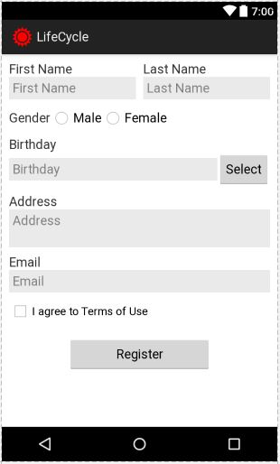

# Android.VP.20231.FormRegister
Form Register Application

**Bài 2. Lập trình ứng dụng với các yêu cầu sau:**

\+ Giao diện tương tự như ảnh đính kèm

\+ Tạo 2 file layout thiết kế giao diện (1 file sử dụng ConstraintLayout, 1 file không sử dụng ConstraintLayout)

\+ Sử lý sự kiện nhấn nút Register thì kiểm tra các thông tin đã được nhập đủ, check box đã được chọn chưa. Nếu chưa thì cần đưa ra thông báo (Sử dụng lớp Toast để hiển thị thông báo đơn giản)

